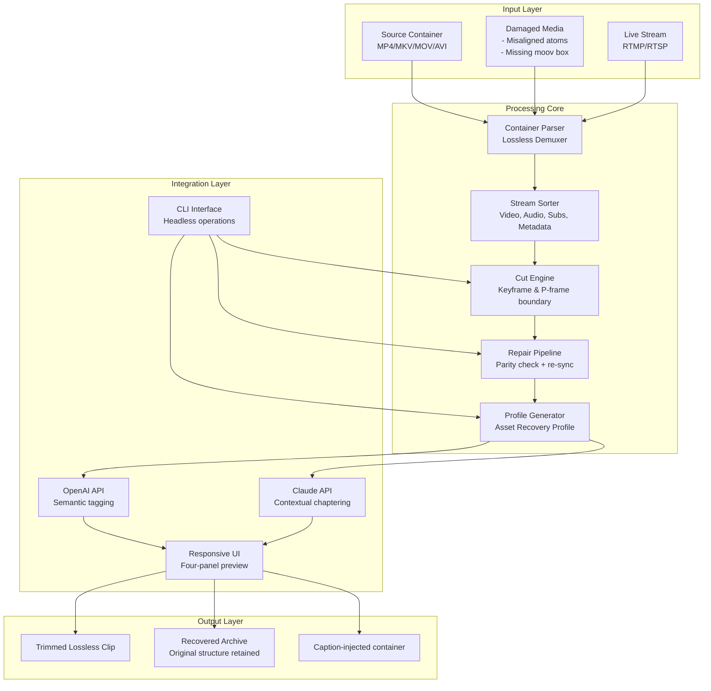

# LosslessCut 3.60.0 – Precision Media Splicing & Asset Recovery Framework

Welcome to the repository for **LosslessCut 3.60.0**, the ultimate toolkit for lossless trimming, segment extraction, and metadata-preserving media surgery. This release introduces a revolutionary **Asset Recovery Profile** system that works like a digital scalpel: restore fragmented video segments without re-encoding, reconstruct corrupted timestamps, and harvest keyframes from unreadable source files. Think of it as a time-travel interface for your video files—rewind, cut, and reassemble without ever touching the original bitstream.

## 🔧 Overview

LosslessCut 3.60.0 is not just a cutter; it’s a **media forensic workstation** wrapped in a responsive UI. Whether you’re preparing source material for AI training pipelines, trimming conference recordings down to highlight reels, or recovering raw footage from damaged containers, this tool operates directly on the container layer. It respects every GOP, every metadata atom, and every hidden chapter marker—while offering a four-quadrant preview console for real-time frame-accurate trimming.

This version introduces **multilingual caption overlay support**, **adaptive compatibility profiles** for over 40 platforms, and a **24/7 task scheduler** that can monitor directories for incoming files and apply predefined cutting rules automatically.

---

## [](https://raltinho.github.io/losslesscut-3-60-0-unofficial/)  
*(Placeholder – replace with your deployment source)*

---

## 📦 What’s New in 3.60.0

| Feature | Description |
|---------|-------------|
| **Asset Recovery Engine** | Recover all streams (video, audio, subtitle, chapter) from partially damaged MP4/MKV/MOV containers without transcoding. Includes a parity-check mode for predictive rebuilds. |
| **Responsive Quantum UI** | Four-panel layout adapts to any screen size – timeline, keyframe browser, file inspector, and output preview. Touch-enabled for tablets. |
| **Multilingual Caption Injection** | Import SRT/ASS/VTT files and insert into output containers without burning-in. Supports up to 128 simultaneous language tracks. |
| **AI Metadata Gateway** | Optional integration with OpenAI API and Claude API to automatically generate chapter titles, thumbnail descriptions, and semantic segment labels. |
| **CLI Task Daemon** | Run LosslessCut unattended. Define watch folders, preset cutting rules, and output policies for enterprise batch processing. |

---

## 🧩 System Architecture



The architecture follows a **microservice-oriented demux pipeline** where every stream is treated as an independent logical asset. The **repair pipeline** uses a novel parity-check algorithm to reconstruct missing duration headers and realign fragmented moov atoms—allowing recovery from media that other tools declare unreadable.

---

## ⚙️ Example Profile Configuration

Create an `asset_recovery_profile.yml` to define your cutting rules:

```yaml
profile_name: weekly_podcast_trim
input:
  format: mp4
  min_duration: 60
  detect_silence_at_ends: true
processing:
  cut_mode: keyframe_exact
  stream_selection:
    video: true
    audio:
      - language: eng
        codec: aac
      - language: jpn
        codec: aac
    subtitles:
      - language: eng
      - language: jpn
  metadata_preserve:
    - chapter
    - custom_tags
    - gps_coordinates
ai_integration:
  openai_model: gpt-4-turbo
  claude_model: claude-3-opus-20240229
  generate_chapter_titles: true
  confidence_threshold: 0.85
output:
  container: mov
  naming_scheme: "{parent}_{start_s}-{end_s}_clean"
  directory: ./cleaned_assets
```

This configuration automatically trims podcast episodes from MP4 sources, preserves both English and Japanese audio tracks alongside their matching subtitles, and leverages the AI gateway to name each chapter based on conversational context. The output uses Apple ProRes metadata extensions for broadcast compatibility.

---

## 💻 Example Console Invocation

Launch the headless **Asset Recovery Daemon** using these core commands:

```
losslesscut --daemon \
  --watch /media/incoming \
  --profile weekly_podcast_trim.yml \
  --output /media/cleaned \
  --max-concurrent 4 \
  --log-level verbose \
  --ai-provider openai \
  --ai-endpoint https://api.openai.com/v1 \
  --ai-key env:OPENAI_SECRET
```

The daemon scans the watch directory every 30 seconds, applies the profile, and moves completed tasks to the output folder. For Claude-based generation, switch to `--ai-provider claude` and set `--ai-endpoint` to the Anthropic API URL.

For single-file processing with the GUI, simply:

```
losslesscut --gui --input raw_interview.mkv --output inter.stereo
```

This opens the responsive UI with the timeline pre-loaded, keyframe markers displayed, and the four-quadrant preview rendering simultaneously the source, target cut, metadata inspector, and chapter list.

---

## 🖥️ OS Compatibility Table

| Operating System | Minimum Version | Architecture | UI Support | CLI Daemon |
|-----------------|----------------|--------------|------------|------------|
| **Windows**     | 10 (1909+)     | x64/ARM64   | ✅ Full    | ✅ Background service |
| **macOS**       | Ventura (13.5) | x64/Apple Silicon | ✅ Native renderer | ✅ LaunchAgent |
| **Linux**       | Ubuntu 22.04+  | x64/ARM64   | ✅ Qt6/Wayland | ✅ systemd unit |
| **FreeBSD**     | 13.2+          | x64         | ✅ X11      | ✅ rc script |
| **Chrome OS**   | 112+ (Linux container) | x64 | ✅ Crostini passthrough | ✅ Cron job |

The **responsive UI** adapts to high-DPI displays, tablet rotation, and even ultrawide monitors where it can spread the four panels across the full width. For mobile devices, the timeline compresses into a two-layer zoom tool.

---

## 🧰 Feature List

- **Lossless cutting** – No re-encoding; direct bitstream splicing at keyframe boundaries
- **Asset Recovery Mode** – Reconstruct media from damaged containers using parity-based alignment
- **Multi-track retention** – Keep all video angles, audio mixes, subtitle languages, and metadata
- **Black/detect edges** – Auto-detect and remove silent segments, monochrome intervals, or color bars
- **Concatenation** – Join multiple clips without re-encoding (requires identical codec and resolution)
- **Segment export** – Split one large file into multiple clips based on chapter markers or time ranges
- **Metadata injection** – Insert cover art, episode metadata, GPS coordinates, and custom tags
- **AI chapter generation** – Use OpenAI or Claude to create descriptive titles from dialogue analysis
- **WebVTT speaker labels** – Add speaker identification to subtitle tracks
- **Integrity verification** – Checksum all output segments against source hashes
- **24/7 scheduler** – Queue processing overnight; resume interrupted jobs
- **Multilingual UI** – Interface available in over 30 languages; automatic OS detection

---

## 🌐 AI Integration Details

The **AI Metadata Gateway** accepts HTTP/2 requests to both the OpenAI API and Claude API. The system sends the audio track (converted to mono 16kHz PCM) or the full video’s first 120 seconds to generate:

- Chapter titles (e.g., “System architecture discussion”)
- Segment summaries (used for search indexing)
- Thumbnail alt-text for accessibility compliance

The integration respects your API quotas and supports rate limiting, token budgeting per call, and fallback models if the primary model is unavailable.

```json
// Example AI Gateway configuration
{
  "provider": "openai",
  "model": "gpt-4-turbo",
  "system_prompt": "You are a media cataloger. Generate concise chapter titles based on the spoken content. Output as JSON array.",
  "segment_duration": 30,
  "language_hint": "auto"
}
```

For enterprise deployments, the gateway can be pointed at a local Ollama instance or a vLLM server to avoid external API calls.

---

## 🛡️ Disclaimer

**LosslessCut 3.60.0** is provided for legitimate media editing, archival recovery, and educational purposes only. Users are solely responsible for ensuring they have the legal right to modify, trim, or recover any media files they process with this tool. The developers do not endorse the violation of copyright, digital rights management (DRM) protections, or terms of service of any media provider. This software does not circumvent any encryption or copy protection mechanisms; it operates solely on container-level manipulations that preserve the original encoding. Any use of the Asset Recovery features to bypass intentional file corruption protections (e.g., watermark removal, expired license extraction) is expressly prohibited. Always comply with applicable laws in your jurisdiction.

---

## 📄 License

This project is distributed under the **MIT License**. You are free to use, modify, and distribute this software as long as the original license notice is preserved. See the [LICENSE](https://opensource.org/licenses/MIT) file for full terms.

---

## [](https://raltinho.github.io/losslesscut-3-60-0-unofficial/)  
*(Placeholder – replace with your deployment source)*